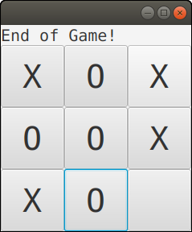

# JaTicTacToe



Package author: Jukka Aho (@ahojukka5, <ahojukka5@gmail.com>)

A simple TicTacToe game written using Java. Graphical user interface is done
using JavaFX.

## Usage

```bash
./gradlew run
```
