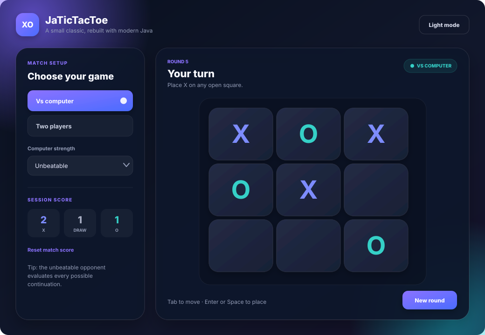

# JaTicTacToe

A polished desktop Tic-Tac-Toe game built with modern Java and JavaFX.

The original 2020 learning project has been rebuilt as a small, production-quality desktop application with a separated game engine, a deterministic minimax opponent, a responsive interface, automated tests, and native packaging support.

<p align="center">
  
</p>

## Highlights

- Modern JavaFX interface with dark and light themes
- Play locally with two people or against the computer
- Relaxed and unbeatable computer difficulty levels
- Animated moves, winning-cell highlights, round status, and session score
- Keyboard-friendly board controls and accessible cell descriptions
- Pure Java game engine with no UI dependencies
- JUnit 5 tests for game rules and computer strategy
- Gradle toolchains, coverage, `jlink`, and `jpackage`

## Requirements

- JDK 21 or newer

The Gradle wrapper downloads all other dependencies.

## Run

```bash
./gradlew run
```

On Windows:

```powershell
.\gradlew.bat run
```

## Verify

```bash
./gradlew test jacocoTestReport
```

The HTML coverage report is written to `build/reports/jacoco/test/html/index.html`.

## Package

Create a platform-specific runtime image:

```bash
./gradlew jlink
```

Create a native installer using the JDK `jpackage` tool:

```bash
./gradlew jpackage
```

Packaging must be run on the target operating system. The generated artifacts are placed under `build/`.

## Architecture

- `Board` owns the rules and round state.
- `ComputerPlayer` implements relaxed tactical play and perfect minimax play.
- `App` contains the JavaFX presentation and coordinates rounds and scoring.
- `app.css` defines both visual themes without external UI libraries or assets.

## License

See the repository license file.
